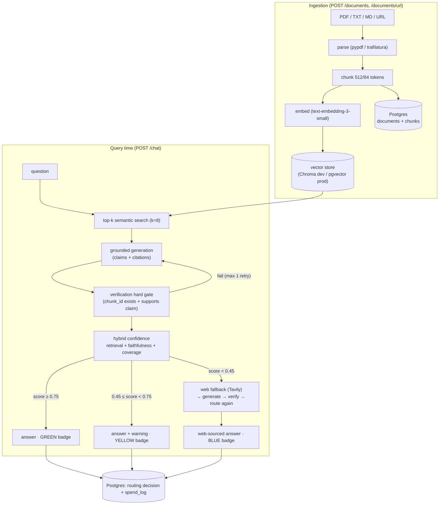

# Axiom

> Start from what you can prove.

A citation-grounded RAG agent. Every claim is tied to a retrieved, verified source; low-confidence answers are visibly flagged; when retrieval fails, Axiom falls back to live web search instead of guessing.

**The measurable goal: zero unsupported claims reach the user unflagged.**

## How it works

Documents → chunks → embeddings → vector store. At query time: retrieve → generate with inline citations → **verify every citation (hard gate)** → score confidence → answer / flag / fall back to web search. Every routing decision is logged.



Every LLM/embedding/search call passes the budget guard (`spend_log`); exceeding a cap returns `429 BUDGET_EXCEEDED`. A refusal (`INSUFFICIENT_EVIDENCE`) gets a neutral badge — a flagged "I don't know" beats a confident hallucination.

See [docs/Architecture.md](docs/Architecture.md) for the full design.

## Documentation

| Doc | Contents |
|-----|----------|
| [docs/Prompt.md](docs/Prompt.md) | Master build prompt (v1.1) |
| [docs/PRD.md](docs/PRD.md) | Product requirements |
| [docs/Architecture.md](docs/Architecture.md) | System design, pipeline, tech stack |
| [docs/Design.md](docs/Design.md) | API contracts, data models, prompts, UX |
| [docs/Rules.md](docs/Rules.md) | Non-negotiable project rules |
| [docs/Phases.md](docs/Phases.md) | Build order + exit criteria |
| [docs/EVAL.md](docs/EVAL.md) | Evaluation strategy + targets |
| [docs/DEPLOY_RUNBOOK.md](docs/DEPLOY_RUNBOOK.md) | Deploy walkthrough (Render + Vercel + Neon) |
| [docs/RELEASE_CHECKLIST.md](docs/RELEASE_CHECKLIST.md) | Final live gates and launch handoff |
| [docs/CONTRIBUTING.md](docs/CONTRIBUTING.md) | Workflow + merge checklist |
| [docs/adr/](docs/adr/) | Architecture decision records |

## Quickstart

### With Docker (the whole stack)

Boots FastAPI + Postgres + Chroma together. This is what the Phase 0 exit
criterion checks.

```bash
cp .env.example .env
docker compose up --build --wait
curl http://localhost:8000/health
```

`/health` returns `200` with `{"status":"ok","service":"Axiom",...}`. Tear down
with `docker compose down -v`.

### Backend only (local Python)

Requires Python 3.11.

```bash
cd backend
python -m venv .venv && . .venv/bin/activate   # Windows: .venv\Scripts\activate
pip install -e ".[dev]"
uvicorn app.main:app --reload
```

Then `curl http://localhost:8000/health`. Run the quality gates the same way CI
does:

```bash
cd backend
ruff check . && ruff format --check . && mypy && pytest
```

### Frontend only (local Node)

Requires Node 20 and pnpm 9 (the versions are pinned and asserted).

```bash
cd frontend
corepack enable
pnpm install --frozen-lockfile
pnpm run assert:toolchain
pnpm run dev        # http://localhost:5173
```

`pnpm run build` produces the production bundle; CI runs the same build.

## Configuration

- **Knobs** (thresholds, weights, `k`, chunk size, budget defaults) live in
  [`config.yaml`](config.yaml). Nothing tunable is hardcoded.
- **Secrets and per-environment values** live in `.env` only. Copy
  [`.env.example`](.env.example) — every variable is documented there.
- The deployed browser origin is supplied with `CORS_ORIGINS`; production does
  not require editing `config.yaml` for CORS.
- Budget caps (`MAX_REQUEST_TOKENS`, `DAILY_TOKEN_CAP`, `MONTHLY_SPEND_USD`) set
  in `.env` override the `budget.*` defaults in `config.yaml`.

## Evaluation

Axiom's tagline is measurable, so it is measured. A golden set of 30 Q&A pairs
(18 in-corpus / 6 out-of-corpus / 6 adversarial) runs the **real** query pipeline
over deterministic offline doubles — no live calls in CI (EVAL.md). Re-run with:

```bash
cd backend
pytest evals/                 # offline gate (CI default)
pytest evals/ --run-llm       # + live RAGAS scoring (needs OPENAI_API_KEY, spends tokens)
```

| Metric | Result | Target |
|--------|--------|--------|
| Citation precision | **1.000** (24/24) | ≥ 0.95 |
| Unsupported-claim escape rate | **0** | 0 |
| Confident out-of-corpus answers | **0** | 0 |
| Web-fallback rate | 0.200 (6/30) | — |
| Faithfulness (RAGAS) | `--run-llm` | ≥ 0.85 |
| Answer relevancy (RAGAS) | `--run-llm` | ≥ 0.80 |

Offline numbers are reproducible from `pytest backend/evals/`; RAGAS faithfulness
and answer relevancy need a live judge model and are gated behind `--run-llm`.
The hallucination gate (`evals/test_hallucination.py`) fails the build if any
fabricated citation reaches the user or any out-of-corpus question is answered
confidently — this is the test that proves the tagline.

### Threshold tuning

Router thresholds were tuned on the golden set (`python -m evals.tuning`, full
report in [`backend/evals/reports/threshold-tuning.md`](backend/evals/reports/threshold-tuning.md)).
The in-corpus score floor is 0.905; a 0.15 noise buffer below it lands `high` at
0.75, confirming the a-priori default. In-corpus recall holds at 100% until
`high` crosses the floor, and the escape rate is 0 at **every** threshold.

| Thresholds | In-corpus trusted (green) | In-corpus flagged | Escapes |
|------------|---------------------------|-------------------|---------|
| before — default `high=0.75, low=0.45` | 18/18 | 0 | 0 |
| after — tuned `high=0.75, low=0.45` | 18/18 | 0 | 0 |
| stress `high=0.95` | 3/18 | 15 | 0 |

## API (v1)

Base URL `/api/v1`. Ingestion, retrieval, and chat need the configured
OpenAI-protocol provider key in `OPENAI_API_KEY` (the checked-in Gemini setup
uses a Gemini API key and the `OPENAI_API_BASE` from `.env.example`). The key
covers embeddings and generation; without it those operations return a
structured `503`.

| Method | Path | Purpose |
|--------|------|---------|
| `POST` | `/documents` | Upload a PDF/TXT/MD file |
| `POST` | `/documents/url` | Ingest a URL's main content |
| `GET` | `/documents` | List ingested documents |
| `DELETE` | `/documents/{doc_id}` | Delete a document and its chunks |
| `POST` | `/search` | Top-k semantic search |
| `POST` | `/chat` | Ask a grounded question |
| `GET` | `/sessions/{id}` | Chat history for a session |
| `GET` | `/health` | Liveness |

## Repository layout

```
backend/    FastAPI app: config, errors, rate limiting, DB, RAG pipeline, tests
  app/rag/       parsing, chunking, prompts, citations (pure)
  app/llm/       embedding + LLM providers behind interfaces
  app/vector/    vector store interface (Chroma / in-memory)
  app/db/        SQLAlchemy models + session
  app/services/  ingestion, retrieval, chat, sessions (side effects)
frontend/   React 18 + Vite 5 + Tailwind 3 (pinned): upload box + chat thread
data/        Ingested corpora and the local vector store (gitignored, disposable)
evals/       Golden set and RAGAS reports (Phase 4)
docs/        Spec: PRD, Architecture, Design, Rules, Phases, ADRs
```

## Status

**Phases 0-3 and the Phase 4 implementation are complete, and the public app is
deployed. The v1 release is not complete until the remaining live evidence is
recorded.**

- **Frontend:** [axiom-rag.vercel.app](https://axiom-rag.vercel.app)
- **Backend health:** [axiom-backend-7n5c.onrender.com/health](https://axiom-backend-7n5c.onrender.com/health)

**Public demo:** No sign-in is required. All visitors share the same document
corpus and can list, upload, and delete documents. Do not upload confidential
material.

The backend health endpoint returns HTTP 200, and its CORS preflight accepts
the deployed frontend origin. The full
pipeline is in place: ingestion → top-k retrieval → grounded generation → the
citation **verification hard gate** → confidence scoring → answer / flag / web
fallback, with every routing decision logged and a budget guard on all
LLM/embedding/search calls. Fabricated citations cannot reach the UI (proven by
tests), and out-of-corpus questions are flagged or web-answered, never
hallucinated. Phase 4 adds the golden-set eval harness (see
[Evaluation](#evaluation)), threshold tuning, security hardening, and deploy
configs. To complete v1, record the three live browser smoke tests, RAGAS
faithfulness and answer-relevancy results, the live P95 latency result, and a
demo video shorter than 90 seconds. Then close the remaining Phase 4 items in
[docs/Phases.md](docs/Phases.md) and follow
[docs/RELEASE_CHECKLIST.md](docs/RELEASE_CHECKLIST.md).
