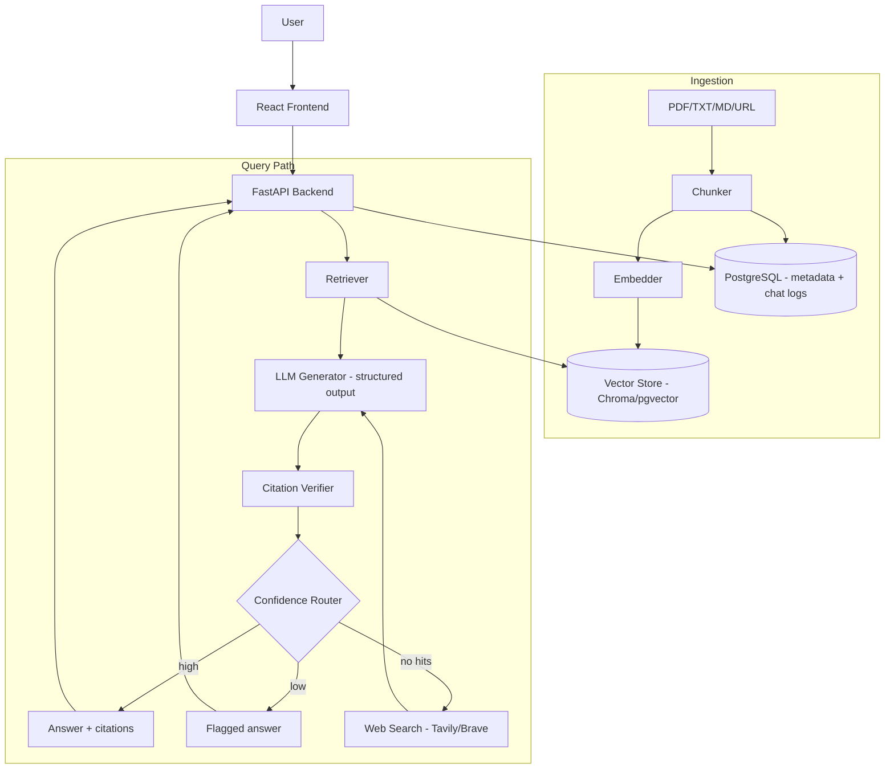

# Axiom — Architecture

> System design for a citation-grounded RAG agent.

---

## 1. High-Level Overview

Axiom has six cooperating subsystems:

1. **Ingestion** — documents → chunks → embeddings → vector store
2. **Retrieval** — query → top-k relevant chunks
3. **Generation** — LLM answers using only retrieved context, emitting structured citations
4. **Grounding** — verifies every citation exists and actually supports its claim
5. **Confidence** — hybrid score decides: answer as-is | flag | fall back
6. **Fallback** — live web search (Tavily/Brave) when retrieval fails

## 2. Architecture Diagram



## 3. Components

### 3.1 Ingestion Pipeline
- **Parser:** pypdf / unstructured for PDFs, trafilatura for URLs
- **Chunker:** recursive character splitting, ~512 tokens ± 15% overlap; each chunk gets a stable `chunk_id` (hash of doc_id + index)
- **Embedder:** OpenAI `text-embedding-3-small` (dev: `sentence-transformers/all-MiniLM-L6-v2`, local)
- **Stores:**
  - Vector store: ChromaDB (dev) → pgvector (prod)
  - Metadata + chat logs: PostgreSQL

### 3.2 Retrieval
- Top-k (k=8) semantic search; optional hybrid (BM25 + vector) via rank fusion (v2)
- Returns chunks with `chunk_id`, `doc_name`, `page`, `score`

### 3.3 Generation
- LLM called with structured output (JSON schema): `answer`, `claims[]`, `citations[]`, `self_assessment`
- System prompt enforces: *only* use provided context; every claim needs a `chunk_id`; respond `INSUFFICIENT_EVIDENCE` if unsupported

### 3.4 Grounding (Citation Verification)

For every citation in the LLM output:
1. **Existence check:** does `chunk_id` exist in the retrieved set? → reject answer if not
2. **Support check:** does the cited chunk text entail the claim?
   - Cheap: keyword/embedding overlap
   - Expensive: NLI-style LLM verification on sampled claims (v2: all claims)

Failures → answer regenerated (max 1 retry) or flagged.

### 3.5 Confidence Scoring (hybrid)

```
confidence = w1 * retrieval_score      (normalized similarity)
           + w2 * llm_faithfulness    (0-1 from verification pass rate)
           + w3 * citation_coverage   (claims with verified citations / total claims)
```

- `>= 0.75` → answer normally
- `0.45 - 0.75` → answer + low-confidence badge
- `< 0.45` or zero retrieved hits → fallback

Weights are config, tuned on the golden eval set. All inputs logged for re-tuning.

### 3.6 Fallback
- Tavily or Brave Search API (generous free tiers)
- Results injected as additional context with `source=web` and live URLs; same grounding rules apply

## 4. Data Flow (Query)

1. `POST /chat {question, session_id}`
2. Embed question → retrieve top-k chunks
3. Build grounded prompt → LLM → structured answer
4. Verify citations → compute confidence
5. Route: respond / flag / fallback → persist everything to Postgres
6. Stream final response to frontend with citation cards

## 5. Tech Stack

| Layer | Choice | Dev alternative |
|-------|--------|-----------------|
| Frontend | React + Vite + Tailwind | Next.js |
| Backend | FastAPI + Pydantic | — |
| LLM | Groq / OpenAI API | Ollama (Llama 3.1) |
| RAG framework | LlamaIndex | raw LangChain |
| Embeddings | text-embedding-3-small | all-MiniLM-L6-v2 |
| Vector DB | ChromaDB | pgvector |
| Relational DB | PostgreSQL | SQLite |
| Web search | Tavily | Brave |
| Evals | RAGAS + pytest | — |
| Deploy | Render + Vercel + Neon | Docker Compose local |

## 6. Scaling Notes (beyond v1)

- Move ingestion + verification to async workers (Arq/Celery)
- Cache embeddings per doc hash; dedupe chunks
- Confidence thresholds per-tenant via config
- Observability: Langfuse or OpenTelemetry traces per request
